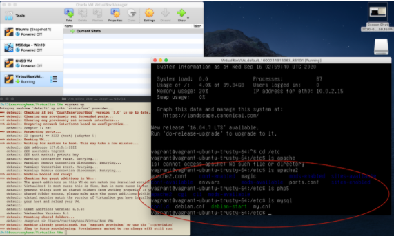

# Create a vagrant-based LAMP stack system from a Windows machine

### Creating the box

1. Install [Git Bash for Windows](https://gitforwindows.org/) and go through the Setup Wizard.
2. If you already have [Oracle VM Virtual Box](https://www.virtualbox.org) installed, proceed to step 3; if not, download and install it. 
3. Download the [VirtualBox Oracle VM VirtualBox Extension Pack](https://www.virtualbox.org/wiki/Downloads)</br>
Install by navigating to File>Preferences>Extensions. Click the green plus button (on the right) and add the Extension Pack you just downloaded.
4. Download and install [Vagrant](https://www.vagrantup.com/downloads) and restart your system.</br>
Confirm Vagrant is installed by typing</b>
`vagrant --version`</br>
5. From Git Bash, make a directory named Vagrant, change directories into it, make another directory named trusty64, and change directories into trusty64
```
mkdir Vagrant
cd Vagrant
mkdir trusty64
cd trusty64
```
6. Navigate to [Vagrant Cloud](https://app.vagrantup.com/boxes/search) and click on [ubuntu/trusty64](https://app.vagrantup.com/ubuntu/boxes/trusty64)</br>
Choose “New” (the right tab)
7. In your Git Bash, either copy and paste or type in the first line:</br>
```
vagrant init ubuntu/trusty64
```
The return should read:</br>
"A ‘Vagrantfile' has been placed in this directory. You are now ready to 'vagrant up' your first virtual environment! Please read the comments in the Vagrantfile as well as documentation on 'vagrantup.com' for more information on using Vagrant."

8. In your Git Bash enter:
```
vagrant up
```
9. Your virtual machine should start running, which you will be able to observe within your VirtualBox interface. To open the console, click the green “Show” arrow at the top of the VirtualBox interface.
10. In your virtual machine console, login with the following credentials:</br>
```
Login: vagrant
Password: vagrant
```
(password entry will be hidden)</br>

11. Install and update apt:
```
sudo apt-get install
sudo apt-get update
```
12. We will now install Apache2, MySQL Server, and PHP 5
```sudo apt-get install apache2
sudo apt-get install mysql-server libapache2-mod-auth-mysql php5-mysql
```
Choose a new password when prompted, and then continue with the following commands:</br>
```
sudo mysql_install_db
sudo /usr/bin/mysql_secure_installation
```
go through the setup process, and then continue with the following commands:</br>
```
sudo apt-get install php5 libapache2-mod-php5 php5-mcrypt
sudo apt-get install php5-cgi php5-cli php5-curl php5-common php5-gd php5-mysql
sudo service apache2 restart
```
13. From here, you can change directories into /etc to confirm all programs have been installed 
14. Now, we’ll make the box as small as possible in preparation for publication to Vagrant cloud. From your GitBash, run the following commands:
```
sudo apt-get clean
sudo dd if=/dev/zero of=/EMPTY bs=1M
sudo rm -f /EMPTY
cat /dev/null > ~/.bash_history && history -c && exit
```
15. Next, we’ll repackage the box. From GitBash, run:
```
vagrant package --output examplename.box
```
16. Now we can delete and remove the file we built our box from. From GitBash, run:
```
vagrant destroy
rm Vagrantfile
```
17. Next, add your new box into your vagrant install:
```
vagrant box add examplenamebox examplename.box
```
18. Initialize a vagrant environment from our newly created box and spin it up:
```
vagrant init examplenamebox
vagrant up
```
If your vagrant box is having trouble connecting, you can click the green “Show” in Oracle VM and - within the console - enter the letter “s”

19. Publish the box on [Vagrant Cloud](https://app.vagrantup.com/)!</br>
Once you’ve established a Vagrant Cloud account, from GitBash:</br>
```
vagrant cloud auth login
```
enter your credentials</br>
`vagrant cloud publish` ORGANIZATION/BOX-NAME VERSION PROVIDER-NAME [PROVIDER-FILE]

Example:</br> 
```
vagrant cloud publish CourtHans/courtbox 1.0 virtualbox ~/Vagrant/trusty64/chans.box -d “My first vagrant box” --version-description “First iteration” --release --short-description “Download me!”
```
You’ll get confirmation in your terminal, and can see and access the box from Vagrant Cloud.

### Pulling the box onto another machine

1. Repeat above steps 1-4 as necessary.
2. Make a directory to pull your vagrant box into and reference your [Vagrant Cloud](https://app.vagrantup.com/) instance while going through step 7 (`vagrant init` ... )
3. `vagrant up` to get into your vagrant box
4. Again, click on the green “Show” arrow in Oracle VM to open the console, if necessary, and enter “s” to complete the connection.
5. You can navigate to the /etc folder to confirm all your downloads are present.



